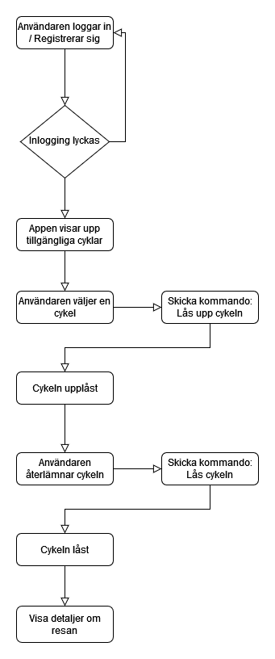

# Användarens app

_Hemskärm i mobilapp_

Alternativt kartbild istället för Hemskärm

I användarens app kan en användare hyra och återlämna elsparkcyklar. Appen är mobilanpassad och byggs i React. Elsparkcyklar som är registrerade i systemet för uthyrning och inte upptagna eller under service kan av en användare väljas för uthyrning via en app. För att kunna hyra en elsparkcykel måste användaren autentisera och identifiera sig, detta görs via Ouath med ett GitHub konto. När användaren loggar in i appen visas en kartbild med tillgängliga elsparkcyklar, laddstationer och rekommenderade parkeringsplatser. I vårt program identifieras en elsparkcykel genom att från kartbilden välja elsparcykelns ikon vilket ger användaren möjligheten att välja vald elsparkcykel för uthyrning.

Då en uthyrning påbörjats så låses cykeln upp och användaren kan manövrera elsparkcykeln under hyrtiden. 

Användaren kan också, via appen, få information från den hyrda elsparkcykeln i form av:

- batterinivå
- behov av service (med anledning av t.ex. punktering, trasiga lampor eller dåliga bromsar)

Då användaren avslutar sin sin resa och återlämnar elsparkcykeln så debiteras användarens konto automatiskt för färden. Färdens kostnad kan variera beroende på:

- hur lång hyrestiden är
- om cykeln flyttats från fri parkering (valfri parkeringsplats utanför rekommenderade parkeringszoner) till en mer önskvärd parkeringsplatsen
- om cykeln parkeras genom fri parkering

När färden avslutats låses cykeln igen.

Denna bild ger en översikt över flödet för att hyra en elsparkcykel i användarens mobilapp runda cirklar visar kommandon som utförs i backend.

Figur - flödet i användarens app vid uthyrning av elsparkcykel.
