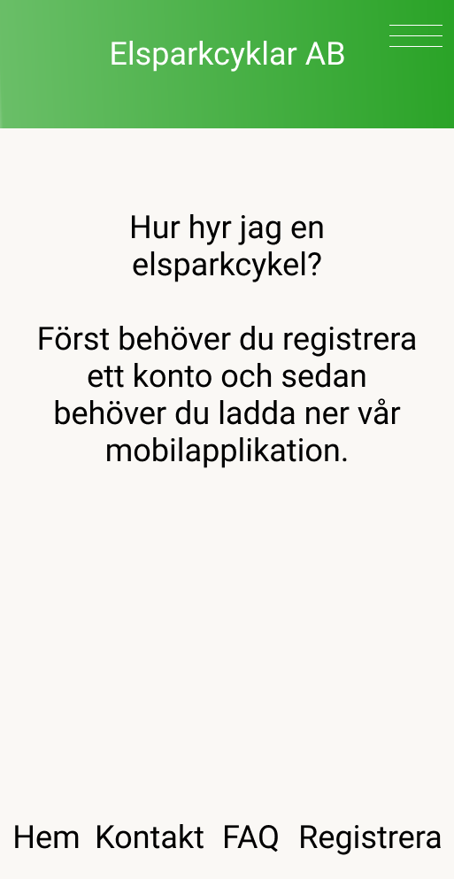

# Användarens app

_Hemskärm i mobilapp_

Elsparkcyklar som är registrerade i systemet för uthyrning och inte upptagna eller under service kan av en användare väljas för uthyrning via en app. I vårt program identifieras en elsparkcykel genom att från en kartbild välja elsparcykelns ikon vilket ger användaren möjligheten att välja vald elsparkcykel för uthyrning.
(I verkligheten görs detta genom att scanna en QR-kod som identifierar elsparkcykeln. [referens](https://turiststockholm.se/sightseeing-guider/hyra-elsparkcykel-i-stockholm-med-voi/) ). För att kunna hyra en elsparkcykel måste användare autentisera och identifiera sig, detta görs via Ouath med ett GitHub konto.

Då en uthyrning påbörjats så låses cykeln upp och användaren kan manövrera elsparkcykeln under hyrtiden. 

Användaren kan också, via appen, få information från den hyrda elsparkcykeln i form av:

- batterinivå
- behov av service (med anledning av t.ex. punktering, trasiga lampor eller dåliga bromsar)

Då användaren avslutar sin hyrning av elsparkcykeln så debiteras användarens konto automatiskt för färden. Färdens kostnad kan variera beroende på:

- hur lång hyrestiden är
- om cykeln flyttats från fri parkering (valfri parkeringsplats utanför rekommenderade parkeringszoner) till en mer önskvärd parkeringsplatsen
- om cykeln parkeras genom fri parkering

Denna bild ger en översikt över flödet i användarens mobilapp:

Denna kartbild visar var samtliga laddstationer och rekommenderade parkeringsplatser finns.

Denna kartbild visar var samtliga lediga elsparkcyklar finns att hitta.

_Logga in i mobilapp_

_Registrera i mobilapp_

_Kontakta företaget i mobilapp_

_Frågor och svar i mobilapp_
