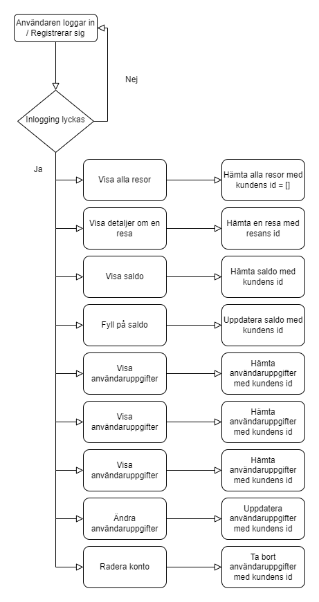

# Användarens webbgränssnitt

*Hemskärm i webbläsare för dator*

Denna del av systemet är en desktop-app som byggs i React - ett JavaScript bibliotek för att skapa användargränssnitt.[1] I användarens webbgränssnitt kan en användare logga in för att se och ändra detaljer om sitt konto. Användaren skapar ett konto och loggar in via OAuth med hjälp av sina Github uppgifter. 

Det är också möjigt att skapa ett konto på sedvanligt vis genom att uppge:

- förnamn
- efternamn
- adress
- faktureringsadress
- användarnamn
- lösenord

När användaren loggar in har denne möjlighet att ändra detaljer angående kontot eller radera det. 

Användaren kan i webbgränssnitttet också se detaljer om sina resor som innefattar:

* ID på resan
* Startdatum (2000-01-01)
* Starttid (11:11 LT)
* Slutdatum (2000-01-01)
* Sluttid (11:11 LT)
* Startpunkt
* Slutpunkt
* Kostnad för resan (kronor, ören)

Slutligen kan användaren då denne loggat in på sitt konto också se och fylla på det saldo som används för att bekosta resor med elsparkcykel. Alternativt kan användaren koppla sig till och betala via en betalningstjänst, i så fall dras en avgift varje månad. 

Nedanstående diagram visar flödet i användarens webbgränssnitt:

[1] Se <https://reactjs.org/>

Nedanstående tabell flyttas till avsnittet API.

## Substantiv

* Användare
* Administratör
* Huvudadministratör
* Elsparkcykel
* Laddstation
* Stad
* Förbjuden zon
* Verkstad

## Verb

* En användare ska hyra en elsparkcykel

`URL`                         | `GET`                                  | `POST`                         | `PUT`                                       | `DELETE`
------------------------------|:--------------------------------------:|:------------------------------:|:-------------------------------------------:|:-------------------:
`/users/`                     | Visa alla användare                    | Skapa en ny användare          | :x:                                         | :x:
`/users/{id}`                 | Visa en användare med id {id}          | :x:                            | Modifiera en användare med id {id}          | Ta bort en användare med id {id}
`/users/{id}/position`        | Visa positionen för en användare med id {id} | :x:                      | :x: | :x:
`/users/{city}/`              | Visa alla användare som för tillfället hyr en elsparkcykel i stad {city} | :x: | :x: | :x:
`/users/online/`              | Visa alla användare som för tillfället är online | :x: | :x: | :x:
`/users/offline/`             | Visa alla användare som för tillfället är offline | :x: | :x: | :x:
`/administrators/`            | Visa alla administratörer              | Skapa en ny administratör      | :x:                                         | :x:
`/administrators/{id}`        | Visa en administratörer med id {id}    | :x:                            | Modifiera en administratör med id {id}      | Ta bort en administratör med id {id}
`/mainAdministrators/`        | Visa alla huvudadministratör           | Skapa en ny huvudadministratör | :x:                                         | :x:
`/mainAdministrators/{id}`    | Visa en huvudadministratör med id {id} | :x:                            | Modifiera en huvudadministratör med id {id} | Ta bort en huvudadministratör med id {id}
`/cities/`                    | Visa alla städer                       | Skapa en ny stad               | :x:                                         | :x:
`/cities/{id}`                | Visa en stad med id {id}               | :x:                            | Modifiera en stad med id {id}               | Ta bort en stad med id {id}
`/cities/{id}/forbiddenZones/` | Visa alla förbjudna zoner i stad med id {id} | :x: | :x: | :x:
`/cities/{id}/electricScooters/` | Visa alla elsparkcyklar i stad med id {id} | :x: | :x: | :x:
`/cities/{id}/chargingStations/`  | Visa alla laddstationer i stad med id {id} | :x: | :x: | :x:
`/cities/{id}/workshops/`     | Visa alla verkstäder i stad med id {id}  | :x:           | :x:                                         | :x:
`/electricScooters/`          | Visa alla elsparkcyklar                | Skapa en ny elsparkcykel       | :x:                                         | :x:
`/electricScooters/rented`    | Visa alla elsparkcyklar som just nu är uthyrda | :x: | :x:                                         | :x:
`/electricScooters/stale`     | Visa alla elsparkcyklar som just nu inte är uthyrda | :x: | :x:                                         | :x:
`/electricScooters/serviced`  | Visa alla elsparkcyklar som just nu är under service | :x: | :x:                                         | :x:
`/electricScooters/{id}`      | Visa en elsparkcykel med id {id}       | :x:                            | Modifiera en elsparkcykel med id {id}       | Ta bort en elsparkcykel med id {id}
`/electricScooters/{id}/position` | Visa positionen för en elsparkcykel med id {id} | :x: | :x: | :x:
`/electricScooters/{id}/batteryLevel` | Visa batterinivån för en elsparkcykel med id {id} | :x: | :x: | :x:
`/electricScooters/{id}/stop` | :x:                                    | Stoppa elsparkcykeln           | :x:                                         | :x:
`/chargingStations/`          | Visa alla laddstationer                | Skapa en ny laddstation        | :x:                                         | :x:
`/chargingStations/{id}`      | Visa en laddstation med id {id}        | :x:                            | Modifiera en elsparkcykel med id {id}       | Ta bort en elsparkcykel med id {id}
`/forbiddenZones/`            | Visa alla förbjudna zoner              | Skapa en ny förbjuden zon      | :x:                                         | :x:
`/forbiddenZones/{id}`        | Visa en förbjuden zon med id {id}      | :x:                            | Modifiera en förbjuden zon med id {id}      | Ta bort en förbjuden zon med id {id}
`/workshops/`                 | Visa alla verkstäder                   | Skapa en ny verkstad           | :x:                                         | :x:
`/workshops/{id}`             | Visa en verkstad med id {id}           | :x:                            | Modifiera en verkstad med id {id}           | Ta bort en verkstad med id {id}
`/parkingZones/`              | Visa en alla parkeringplatser          | Skapa en ny parkeringsplats    | :x:           | :x:
`/parkingZones/{id}`          | Visa en parkeringplats med id {id}     | :x:    | Modifiera en parkeringsplats med id {id}           | Ta bort en parkeringsplats med id {id}
`/trips/`                     | Visa alla resor     | Skapa en ny resa    | :x:            | :x:
`/trips/{id}`                 | Visa en resa med id {id}     | :x:    | Modifiera en resa med id {id}           | Ta bort en resa med id {id}
`/trips/{userId}`             | Visa alla resor med användar-id {användar-id}     | :x:    | :x:           | :x:

