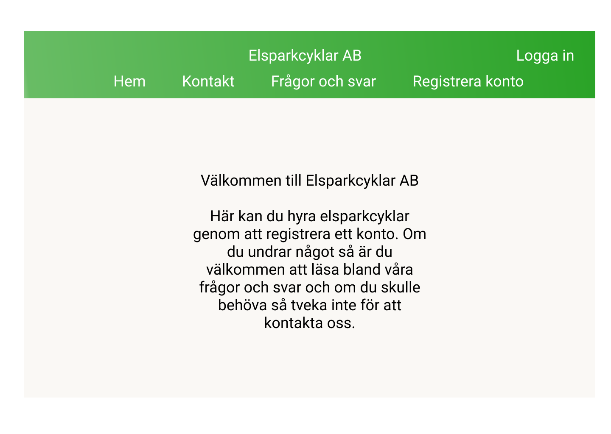

## Inledning

I detta dokument beskrivs ett system som hanterar uthyrning av elsparkcyklar. Systemet ger kunder möjlighet att skapa användarkonton och hyra cyklar, administratörer ges möjlighet att administrera cyklar, laddstationer, parkeringsplatser, städer och information om kunder. Systemet innehåller också ett program för cykeln som styr och övervakar denna.

### Bakgrund

Företaget "Svenska Elsparkcyklar AB" har utryckt ett behov av ett system som kan hantera uthyrning av elsparkcyklar i svenska städer. För närvarande är företaget etablerat och har verksamhet i "TRE STÄDER" och planerar att expandera till fler med stöd av ett nytt datasystem.

Elsparkcyklar är ett, jämfört med andra fortskaffningsmedel, relativt nytt inslag i vår trafikmiljö. De utgör ett nytt sätt att röra sig och kan med rätt förutsättningar utgöra ett miljövänligt sätt att öka transporteffektiviteten i våra städer. Utmaningarna är dock flera, i en utredning från 2021 påpekar Transportstyrelsen att regelverket kan upplevas som otydligt och att många upplever att de som använder cyklarna inte beter sig korrekt. Transportstyrelsen menar i sin utredning att det framförallt rör sig om att användarna parkerar fel och framför fordonen på ett felaktigt sätt. [1] Sedan 1:a september 2022 får elsparkcyklar inte längre framföras på trottoarer och gångbanor och felparkerade cyklar kan beläggas med avgifter. [2]

Vår förhoppning är att det system som vi presenterar här kommer att kunna lösa en del av dessa utmaningar, inte minst genom att uppmuntra användarna till ett korrekt bruk av cyklarna och genom att automatiskt begränsa var och med vilken hastighet cyklarna kan köras.

## Översikt över systemet

### Systemets användare

Systemets huvudsakliga användare är kunder (benämns härefter som användare) och administratörer.

Användare har möjlighet att hyra en cykel via en mobilapplikation som också visar status för senaste resan och en historik över gjorda resor. Användare har också tillgång till ett webbgränssnitt där de kan se sina kontodetaljer och en historik över sin användning och betalningar.

Administratörer har möjlighet att via ett webbgränssnitt se status på cyklar och stationer samt få information om kunder. Administratörer kan också lägga till nya cyklar, laddstationer, zoner för parkering, förbjudna zoner och städer.

### Systemets delar

Systemet omfattar följande huvudsakliga komponenter:

- Databas med information om cyklar, laddstationer, parkeringszoner, tillåtna zoner att cykla i, användare och administratörer.

- Backend - en komponent som sköter kopplingen mellan API och databas.

- API med möjlighet att koppla in anpassade applikationer, grundsystemet levereras med följande applikationer:

  - Administrativt webbgränssnitt där man kan se status för och administrera (ändra, ta bort och lägga till) cyklar, laddstationer, parkeringsplatser, städer och information om kunder.

  - Webbgränssnitt för kunden så att denne kan logga in och se sitt konto, historik av utlåning och betalningar.

  - Mobilanpassad webbapp för kunden så denne kan se låna/lämna tillbaka cykeln samt se status på senaste resan och historik över gjorda resor.

  - Ett cykelprogram som styr och övervakar cykeln (på, av, hastighet, begränsa hastighet, position, behöver service/laddning).

Samtliga applikationer som kopplas mot API:et måste autentisera sin anslutning.

Nedanstående diagram visar en översikt över systemets huvudkomponenter samt hur de relaterar till- och kommunicerar med varandra i olika lager. [3]

*Fig 1. Översikt över systemets huvudkomponenter*

I följande avsnitt beskriver vi systemets olika delar i detalj.

[1] <https://www.transportstyrelsen.se/globalassets/global/publikationer-och-rapporter/vag/slutrapport-utredning-regler-eldrivna-enpersonsfordon.pdf>

[2] Jönköpingsposten 3/9 2022 samt <https://rkrattsbaser.gov.se/sfst?bet=1998:1276> $4

[3] <https://www.oreilly.com/content/software-architecture-patterns/>

Bilder på hur systemet kommunicerar med de olika delarna.

Bilder på olika gränssnitt (mock-ups) ?

UML-diagram (draw.io t.ex.)

Komponentdiagram
# Kundens app

Elsparkcyklar som är registrerade i systemet för uthyrning och inte upptagna eller under service kan av en användare väljas för uthyrning.
I verkligheten görs detta genom att scanna en QR-kod som identifierar elsparkcykeln. [referens](https://turiststockholm.se/sightseeing-guider/hyra-elsparkcykel-i-stockholm-med-voi/).
I vårt program indentifieras en elsparkcykel genom att från en kartbild välja elsparcykelns ikon vilket ger användaren möjligheten att välja vald elsparkcykel för uthyrning.

Då en uthyrning påbörjats så kan användaren manövrera elsparkcykeln. De manövreringsmöjligheter som finns är:

- elsparkcykelns hastighet (gashandtag)
- svänga vänster och höger genom att svänga med styret
- bromsa **_(finns det mer än en broms???)_**

Användaren kan också få information från den hyrda elsparkcykeln i form av:

- batterinivå
- behov av service (med anledning av t.ex. punktering, trasiga lampor eller dåliga bromsar)

Då användaren avslutar sin hyrning av elsparkcykeln så debiteras användarens konto automatiskt för färden. Färdens kostnad kan variera beroende på:

- tid på dygnet (tillgång och efterfrågan)
- om cykeln flyttats från fri parkering (valfri parkeringsplats utanför rekommenderade parkeringszoner) till en mer önskvärd parkeringsplats
- om cykeln parkeras genom fri parkering

Denna kartbild visar var samtliga laddstationer och rekommenderade parkeringsplatser finns.

Denna kartbild visar var samtliga lediga elsparkcyklar finns att hitta.

_Hemskärm i mobilapp_

_Logga in i mobilapp_

_Registrera i mobilapp_

_Kontakta företaget i mobilapp_

_Frågor och svar i mobilapp_

# Kundens webbgränssnitt

När en användare besöker företagets hemsida så behöver användaren registera ett konto för att kunna hyra elsparkcyklar. Det finns flera sätt att skapa ett konto. Antingen görs det på sedvanligt vis genom att uppge:

* förnamn
* efternamn
* adress
* faktureringsadress
* användarnamn
* lösenord

***Författarens kommentar: smidigt formulär utan bekräftelse av lösenord och en knapp som kan visa lösenordet medan det skrivs. Om vi ska kunna registrera med github så får vi inte namn, efternamn, adress. Ska vi ha med det?***

Då användaren loggat in på sitt konto så kan användaren se och fylla på sitt saldo. Saldot används för att bekosta resor med elsparkcykel. Användaren behöver inte ha ett positivt saldo utan kan sedan tidigare ha valt att betala i efterhand via diverse betaltjänster.

Användaren kan också se sin färdhistorik som innefattar:

* ID på resan
* Startdatum (2000-01-01)
* Starttid (11:11 LT)
* Slutdatum (2000-01-01)
* Sluttid (11:11 LT)
* Startpunkt (lat/long, geografiskt närliggande namn?)
* Slutpunkt (lat/long, geografiskt närliggande namn?)
* Kostnad för resan (kronor, ören)

## Substantiv

* Användare
* Administratör
* Huvudadministratör
* Elsparkcykel
* Laddstation
* Stad
* Förbjuden zon
* Verkstad

## Verb

* En användare ska hyra en elsparkcykel

`URL`                         | `GET`                                  | `POST`                         | `PUT`                                       | `DELETE`
------------------------------|:--------------------------------------:|:------------------------------:|:-------------------------------------------:|:-------------------:
`/users/`                     | Visa alla användare                    | Skapa en ny användare          | :x:                                         | :x:
`/users/{id}`                 | Visa en användare med id {id}          | :x:                            | Modifiera en användare med id {id}          | Ta bort en användare med id {id}
`/users/{id}/position`        | Visa positionen för en användare med id {id} | :x:                      | :x: | :x:
`/users/{city}/`              | Visa alla användare som för tillfället hyr en elsparkcykel i stad {city} | :x: | :x: | :x:
`/users/online/`              | Visa alla användare som för tillfället är online | :x: | :x: | :x:
`/users/offline/`             | Visa alla användare som för tillfället är offline | :x: | :x: | :x:
`/administrators/`            | Visa alla administratörer              | Skapa en ny administratör      | :x:                                         | :x:
`/administrators/{id}`        | Visa en administratörer med id {id}    | :x:                            | Modifiera en administratör med id {id}      | Ta bort en administratör med id {id}
`/mainAdministrators/`        | Visa alla huvudadministratör           | Skapa en ny huvudadministratör | :x:                                         | :x:
`/mainAdministrators/{id}`    | Visa en huvudadministratör med id {id} | :x:                            | Modifiera en huvudadministratör med id {id} | Ta bort en huvudadministratör med id {id}
`/cities/`                    | Visa alla städer                       | Skapa en ny stad               | :x:                                         | :x:
`/cities/{id}`                | Visa en stad med id {id}               | :x:                            | Modifiera en stad med id {id}               | Ta bort en stad med id {id}
`/cities/{id}/forbiddenZones/` | Visa alla förbjudna zoner i stad med id {id} | :x: | :x: | :x:
`/cities/{id}/electricScooters/` | Visa alla elsparkcyklar i stad med id {id} | :x: | :x: | :x:
`/cities/{id}/chargingStations/`  | Visa alla laddstationer i stad med id {id} | :x: | :x: | :x:
`/cities/{id}/workshops/`     | Visa alla verkstäder i stad med id {id}  | :x:           | :x:                                         | :x:
`/electricScooters/`          | Visa alla elsparkcyklar                | Skapa en ny elsparkcykel       | :x:                                         | :x:
`/electricScooters/rented`    | Visa alla elsparkcyklar som just nu är uthyrda | :x: | :x:                                         | :x:
`/electricScooters/stale`     | Visa alla elsparkcyklar som just nu inte är uthyrda | :x: | :x:                                         | :x:
`/electricScooters/serviced`  | Visa alla elsparkcyklar som just nu är under service | :x: | :x:                                         | :x:
`/electricScooters/{id}`      | Visa en elsparkcykel med id {id}       | :x:                            | Modifiera en elsparkcykel med id {id}       | Ta bort en elsparkcykel med id {id}
`/electricScooters/{id}/position` | Visa positionen för en elsparkcykel med id {id} | :x: | :x: | :x:
`/electricScooters/{id}/batteryLevel` | Visa batterinivån för en elsparkcykel med id {id} | :x: | :x: | :x:
`/electricScooters/{id}/stop` | :x:                                    | Stoppa elsparkcykeln           | :x:                                         | :x:
`/chargingStations/`          | Visa alla laddstationer                | Skapa en ny laddstation        | :x:                                         | :x:
`/chargingStations/{id}`      | Visa en laddstation med id {id}        | :x:                            | Modifiera en elsparkcykel med id {id}       | Ta bort en elsparkcykel med id {id}
`/forbiddenZones/`            | Visa alla förbjudna zoner              | Skapa en ny förbjuden zon      | :x:                                         | :x:
`/forbiddenZones/{id}`        | Visa en förbjuden zon med id {id}      | :x:                            | Modifiera en förbjuden zon med id {id}      | Ta bort en förbjuden zon med id {id}
`/workshops/`                 | Visa alla verkstäder                   | Skapa en ny verkstad           | :x:                                         | :x:
`/workshops/{id}`             | Visa en verkstad med id {id}           | :x:                            | Modifiera en verkstad med id {id}           | Ta bort en verkstad med id {id}

*Hemskärm i webbläsare för dator*

*Logga in i webbläsare för dator*

*Registrera i webbläsare för dator*

*Kontakta företaget i webbläsare för dator*

*Frågor och svar i webbläsare för dator*

# Administratörsgränssnitt

1. [Administratörsgränssnitt](#org8a596ce)
    1. [Översikt och daglig drift](#org2ecd51a)
    2. [Hantering av kunder](#org34ef10e)
    3. [Behörighetshantering](#org0002f6a)
    4. [Geodatahantering](#org0002f6b)

# Administratörsgränssnitt

Systemets administratörsgränssnitt används av behöriga användare för att få en översikt över företagets alla resurser:

- Kunder
- Städer man är verksam i
- Cyklar
- Laddstationer
- Parkeringsplatser
- Områden med särskilda bestämmelser

Administratörsgränssnitt innehåller vyer för att inspektera resurser, skicka kommandon till enskilda cyklar, hantera kundinformation, hantera behörigheter, samt uppdatera systemet med ny data, t ex nya städer man etablerar sig i, nya cyklar, nya parkeringsplatser etc.

## Översikt och daglig drift

I vyn för översikt och daglig drift presenteras all information kring cyklar, laddstationer, parkeringsplatser och områden med särskilda bestämmelser för varje stad man verkar i. Vyn är kartcentrerad. I kartan kan man se information om aktuell status för alla tillgängliga resurser i vald stad, samt även filtrera kartvyn baserat på resursers typ, identitet eller status. Denna vy används också för att skicka manuella driftkommandon till enskilda cyklar. Det kan t ex  vara ett kommando för att stoppa cykeln, om administratören ser behov av det.

FRÅGA - MAN TÄNKER SIG ATT STOPPKOMMANDO TILL CYKELN BORDE SKE AUTOMATISKT OM EN CYKEL ÅKER FÖR LÅNGT UT TEX.

## Hantering av kunder

Kundvyn är en klassisk listvy. Här kan man se en lista på alla företagets kunder, som kan filtreras på stad, användarnamn, antal gjorda resor m m. I denna vyn kan administratören också uppdatera information om enskilda kunder, t ex för att ge en kund en generell rabatt eller rabatt för en enskild resa. Administratören kan också skapa upp nya kunder i denna vy, även om detta i normalfallet hanteras av kunden själv.

## Behörighetshantering

Vyn för behörighetshantering används för att skapa användare och tilldela dessa behörigheter i administratörssystemet. Huvudadministratören anges vid konfiguration av systemet, men alla övriga roller hanteras i detta gränssnitt.

## Geodatahantering

Systemet har kraftfulla och lättanvända funktioner för att hantera nya marknader och nya resurser. I vyn för geodatahantering kan administratören lägga till nya städer för företaget, samt skapa, uppdatera och radera information om enskilda resurser.

_Översikt över systemet_

# Inneh&aring;ll

-   [Översikt](#org6bd1c17)
    -   [Beteende](#orgde8e420)
    -   [Krav som måste uppfyllas](#org1143c7f)
        -   [Positionsdata](#org1f6a366)
        -   [Status](#orgf56a1bc)
        -   [Sensor](#org0c72933)
        -   [Positionsdata och/eller status och/eller sensor](#org0754226)
    -   [Elsparkcykel <-> server kommunikation](#orgda3bf18)
        -   [HTTP](#org9d12b10)
        -   [Websockets](#org74f00f1)
        -   [IoT protokoll](#org71950ba)
    -   [Simulering](#org355d067)
-   [SDS](#org3d17a31)
    -   [Att göra](#org94bfbf5)
    -   [Cykelns program](#orgd140aaf)

# Översikt

## Beteende

-   Varje elsparkcykel har sitt eget program och id.
-   En elsparkcykel ska kunna meddela position/status med jämna mellanrum.
-   En användare ska kunna hyra och lämna tillbake en elsparkcykel.
-   En administratör ska kunna hantera och se information om elsparkcykeln.

## Krav som måste uppfyllas

Vilken data behövs för att tillmötesgå samtliga krav?

-   [X] Man kan se alla städer och elsparkcyklar som finns i systemet.
-   [X] Varje stad har ett antal laddstationer där elsparkcyklarna kan laddas. Användaren eller servicepersonalen kan förflytta en elsparkcykel dit.
-   [X] Varje stad har ett antal accepterade platser där elsparkcyklar bör parkeras.
-   [X] Elsparkcyklar kan även parkeras utanför laddstationer och utanför accepterade platser,men det kan då tillkomma en extra avgift för användaren. Detta kallas fri parkering.
-   [X] Man kan se var elsparkcyklarna finns parkerade.
-   [X] Man kan se hur många (och vilka) elsparkcyklar som finns på varje laddstation och accepterad parkeringsplats.
-   [X] Varje resa som en användare gör kostar pengar, dels en fast taxa och en rörlig taxa per tidsenhet och en taxa beroende av var de parkerar.
-   [X] Om en användare tar en elsparkcykel som står på fri parkering - och lämnar på en definierad parkering - så blir startavgiften lite lägre
-   [X] Man kan få en översikt över laddstationer och elsparkcyklar och deras position på en karta.
-   [X] (extra) Visa en kartbild där alla alla lediga elsparkcyklar finns.
-   [X] Elsparkcykeln meddelar dess position med jämna mellanrum.
-   [X] Elsparkcykeln meddelar om den kör eller står stilla och vilken hastighet den rör sig i.
-   [X] Man skall kunna stänga av/stoppa en elsparkcykel så att den inte kan köras längre.
-   [X] När en användare hyr elsparkcykeln är det möjligt att starta den och köra.
-   [X] Användaren kan lämna tillbaka en elsparkcykel och släppa kontrollen över den.
-   [X] Elsparkcykeln varnar när den behöver laddas.
-   [X] Elsparkcykeln sparar en logg över sina resor med start (plats, tid) och slut (plats, tid) samt användare.
-   [X] När elsparkcykeln tas in för underhåll eller laddning så markeras det att elsparkcykeln är i underhållsläge. En elsparkcykel som laddas på en laddstation kan inte hyras av en användare och en röd lampa visar att den inte är tillgänglig.
-   [X] \* Ledig elsparkcykel visas som grön, uthyrd som orange, ej tillgänglig som röd.
-   [X] \* hastighet, svänga, bromsa, position, batteri, lampor fungerar, luft i däcken etc.

### Positionsdata

1.  Man kan få en översikt över elsparkcyklar och deras position på en karta
2.  Varje stad har ett antal laddstationer där elsparkcyklarna kan laddas.
    Användaren eller servicepersonalen kan förflytta en elsparkcykel dit.
3.  Varje stad har ett antal accepterade platser där elsparkcyklar bör parkeras.
4.  Elsparkcyklar kan även parkeras utanför laddstationer och utanför accepterade platser,
    men det kan då tillkomma en extra avgift för användren. Detta kallas fri parkering.
5.  Man kan se var elsparkcyklarna finns parkerade.
6.  (extra) Visa en kartbild där alla alla lediga elsparkcyklar finns.
7.  Elsparkcykeln meddelar dess position med jämna mellanrum.
8.  Elsparkcykeln meddelar om den kör eller står stilla och vilken hastighet den rör sig i.

### Status

1.  Man kan se alla städer och elsparkcyklar som finns i systemet.
2.  Man skall kunna stänga av/stoppa en elsparkcykel så att den inte kan köras längre.
3.  När en användare hyr elsparkcykeln är det möjligt att starta den och köra.
4.  Användaren kan lämna tillbaka en elsparkcykel och släppa kontrollen över den.
5.  När elsparkcykeln tas in för underhåll eller laddning så markeras det att elsparkcykeln är i underhållsläge. En elsparkcykel som laddas på en laddstation kan inte hyras av en användare och en röd lampa visar att den inte är tillgänglig.
6.  \* Ledig elsparkcykel visas som grön, uthyrd som orange, ej tillgänglig som röd.

### Sensor

1.  Elsparkcykeln varnar när den behöver laddas.

### Positionsdata och/eller status och/eller sensor

1.  Man kan se hur många (och vilka) elsparkcyklar som finns på varje laddstation och accepterad parkeringsplats.
2.  Varje resa som en användare gör kostar pengar, dels en fast taxa och en rörlig taxa per tidsenhet och en taxa beroende av var de parkerar.
3.  Om en användare tar en elsparkcykel som står på fri parkering - och lämnar på en definierad parkering - så blir startavgiften lite lägre
4.  Elsparkcykeln sparar en logg över sina resor med start (plats, tid) och slut (plats, tid) samt användare.
5.  \* hastighet, svänga, bromsa, position, batteri, lampor fungerar, luft i däcken etc.

## Elsparkcykel <-> server kommunikation

Här har jag, med mina begränsade kunskaper, vänt och vridit på olika sätt att få elsparkcykel
och server att prata med varandra och med risk för eventuella tankevurpor och snetänk
så har jag kommit fram till tre alternativ. (feedback uppskattas!)

### HTTP

Att använda HTTP går bra från elsparkcykel till server, men är värre åt andra hållet.
Tusentals elsparkcyklar kräver lika många unika IP adresser och jag vet helt enkelt inte hur
servern ska kunna hitta/hålla reda på alla.

### Websockets

Med en websockets connection kan data flöda åt båda hållen, men hur tusentals connections
påverkar serverns prestanda har jag idag ingen aning om. Jag tror inte att själva
kopplingen påverkar så mycket, utan snarare vad servern faktiskt gör med data som den får.

### IoT protokoll

Detta känns som en överkurs och skulle bli väldigt förvånad om en IoT lösning hade förväntats av oss.
Men alternativet finns.

## Simulering

Allt ligger lokalt så här är elsparkcykel <-> server kommunikation ett mindre problem.

# SDS

## Att göra

-   Beskrivning av hur det fungerar
    -   val av språk
        -   varför?
    -   implementation
        -   hur?
        -   varför?

-   Ett/flera usecases med tillhörande sekvensdiagram
    -   hyra, lämna tillbaka en elsparkcykel
    -   service

-   Ett stycke om Simuleringen

## Cykelns program

En elsparkcykels huvudsakliga uppgift är att hela tiden meddela sin positon och hälsa via API&rsquo;et.

Elsparkcykelns program har bara information som rör sin egen position samt hälsa och övrig information
som rör dess omgivning skickas till den från backend.

-   Uthyrd till en användare
-   användare avslutar hyran
-   Begränsa hastighet när den befinner sig i specifika zoner
-   Stoppa elsparkcykeln ifall den är utanför tillåtet område.
-   Intagen på service
-   Service utförd

I varje elsparkcykel finns sensorer som känner av hälsan och när den ändras
så skickas den informationen till backend.

-   Batterinivån är låg
-   En lampa har gått sönder
-   Punktering etc.

Det är endast när elsparkcykelns status har blivit ändrad till &rdquo;uthyrd&rdquo; eller på &rdquo;service som
elsparkcykeln är upplåst och går att köra. Så fort dess status återvänder till &rdquo;ledig&rdquo; så
stängs den av och bromsas, och det enda sättat att flytta den är då att fysiskt lyfta upp och bära bort den.
Blir det rörelse på en elsparkcykel som ej är uthyrd skickas då en varning omgående till backend,
och sedan med ett tätt intervall tills den återigen står stilla. Detta möjliggör att personal kan hitta eventuellt stulna
elsparkcykelar.

Tusentals elsparkcyklar finns i systemet. Så för att minimera belastningen på API och backend så
uppdaterar dom sin position med olika intervall beroende på olika faktorer.

-   En uthyrd elsparkcykel i rörelse skickar positionsdata ofta
-   En ledig och stillastående elsparkcykel skickar positionsdata sällan
-   En elsparkcykel på laddning eller service skickar positionsdata sällan

Varje elsparkcykel sparar också en egen historik över alla sina resor.

-   Resans användare
-   Resans startposition samt klockslag
-   Resans slutposition samt klockslag

# Databas

Information systemets olika entiteter samlas i en databas. En entitet kan t.ex. vara "användare", "stad" eller "administratör". Varje entitet har en egen tabell i databasen. I detta avsnitt beskrivs vilka entiteter som finns i databasen, vilka egenskaper de har och hur entiteterna relaterar till varandra.

Den databas som ingår i systemet är en DATABASTYP. Systemet kommunicerar med databasen via ORM/SQL/Redis? (Byggs ut när vi har bestämt oss)

Följande tabeller/entiteter finns i databasen:

## Stad

Denna tabell innehåller information om städer. Varje stad har:

- ett unikt id som identifierar staden i systemet
- ett namn
- en geografisk position

En stad har också relationer till andra entiteter den kan ha en eller flera:

- Elsparkcyklar
- Laddstationer
- Parkeringsplatser
- Zoner
- Verkstäder?

## Elsparkcykel

Denna tabell innehåller information om elsparkcyklar. Varje elsparkcykel har

- ett unikt id
- en position
- en status, ett värde som visar om elsparkcykeln är ok, laddas eller behöver service
- en batterinivå
- en uthyrningsstatus som visar om elsparkcykeln är uthyrd eller inte
- en hastighet

En elsparkcykel har också relationer till andra entiteter, den kan ha:

- en användare (om elsparkcykeln är uthyrd)
- en eller flera (historiska) resor

## Laddstation

Denna tabell innehåller information om laddstationer. Varje laddstation har:

- ett unikt id
- en position

Bör vi också koppla elsparkcyklar till specifika laddstationer?

## Parkeringsplats

Denna tabell innehåller information om parkeringsplatser, både tillåtna och otillåtna. Varje parkeringsplats har:

- ett unikt id
- en position
- en typ som talar om ifall detta är en "+parkeringsplats" en vanlig parkeringsplats eller en förbjuden parkeringsplats

## Zon

Denna tabell innehåller information om särskilda zoner. Varje zon har:

- ett unikt id
- en position
- en typ som visar om det är tillåtet att färdas i zonen eller inte
- en hastighetsbegränsning som bestämmer högsta tillåtna hastighet i zonen?

## Verkstad (ska verkstäder vara med?)

Denna tabell innehåller information om verkstäder där elsparkcyklar servas och repareras. Varje verkstad har:

- ett unikt id
- en position

## Användare

Denna tabell innehåller information om användare. Varje användare har:

- ett unikt id
- ett förnamn (får vi detta med OAuth?)
- ett efternamn (får vi detta med OAuth?)
- en adress (får vi detta med OAuth?)
- en faktureringsadress (får vi detta med OAuth?)
- ett användarnamn (behöver vi detta med OAuth?)
- ett lösenord (behöver vi detta med OAuth?)
- en e-postadress
- ett saldo
- en position? (behöver vi användarnas positioner?)
- en status som visar om användaren är inloggad eller inte? (behöver vi detta?)

En användare har också relationer till andra entiteter, den kan ha:

- en elsparkcykel (om användaren hyr en cykel)
- en eller flera (historiska) resor

## Administratör

Denna tabell innehåller information om administratörer. Varje administratör har:

- ett unikt id
- ett användarnamn
- ett lösenord
- en typ som beskriver administratörens behörighet (huvudadministratör eller vanlig administratör)

## Resa

Denna tabell innehåller information om resor. Varje resa har:

- ett unikt id
- en startposition
- en slutposition
- en starttid
- en sluttid

Nedanstående bild visar de entiteter som förekommer i databasen, deras attribut och inbördes relationer.

_Översikt databas_

# Inneh&aring;ll

-   [REST-API](#orgbe735e5)
    -   [Dokumentation](#orgdda9518)
    -   [Versioner](#org93e4dc0)
    -   [Autentisering](#org6f2c41d)
        -   [Godkänd autentisering](#orge9bf721)
        -   [Misslyckad autentisering](#orgf887b34)

# REST-API

(Hur göra en intern github länk till Richards fantastiska API spreadsheet?)
(Känns som jag behöver skriva lite mer i denna del men kommer inte på vad.)

Systemets applikationer använder ett REST-API för att kommunicera med systemets backend.

## Dokumentation

För att underlätta för tredjepartsleverntörer att bygga externa tjänster och applicationer är
REST-API&rsquo;et väldokumenterat.

-   Länk till dokumentationen?
-   Ett exempel från dokumentationen på en enskild endpoint?

## Versioner

REST-API&rsquo;et har byggts för att vara framtidssäkert där uppdateringar och tillägg hanteras med
versionsnummer som en del i URI:n.

-   &#x2026;/v1/endpoint

## Autentisering

Alla applikationer som använder REST-API&rsquo;et måste autentisera (JWT?) sig för att kontrollera att endast
endpoints som rör applikationen finns tillgängliga.

### Godkänd autentisering

En applikation för administratörer kan se alla användare i systemet.

    GET ../v1/users/

    {
        "data": [
            {
                "id": 1,
                "name": "John Doe",
                ...
    
            },
            {
                "id": 2,
                "name": "Jane Doe",
                ...
            }
        ]
    }

### Misslyckad autentisering

En applikation för användare kan **inte** se alla användare i systemet.

    GET ../v1/users/

    {
        "errors": {
            "status": 401,
            "source": "/users",
            "title": "Authorization failed",
            "detail": "No valid API key provided."
        }
    }

# Hantering av geodata i databas/backend

Vår plattform för hantering av elsparkcyklar behöver kunna hantera geodata på ett effektivt sätt. Geodata kommer att användas dels för presentation av cyklar och andra företeelser på en karta, och dels för vissa enklare analyser. En del av denna "geospatiala kompetens" kommer att befinna sig i en webklient, och en del kommer vi behöva implementera backend. Denna lilla studie försöker identifiera några olika, rimliga, alternativ för implementationen i backend.

## Systemets behov av geospatiala funktioner

Systemet behöver kunna:

* Visa objekt på karta med god prestanda (dvs hantera geografiska index på data)
* Känna av om en elsparkcykel befinner sig i ett område med särskilda begränsningar, t ex hastighetsbegränsning, ej tillåtet att framföra elsparkcykel

Det är även bra om systemet kan:

* Känna av om en elsparkcykel befinner sig utanför vägnätet
* Vid simulering och lasttest av systemet, simulera elsparkcyklars framfart längs vägnätet.

Kraven ovan innebär att systemet måste kunna:

* Lagra information om platsdata med geografiska index, för att möjliggöra god prestanda vid frågor mot databasen
* Stödja point-in-polygon-frågor (pip) för att kunna avgöra om en elsparkcykel befinner sig i ett område med särskilda krav
* Pip-frågor kan också användas för att avgöra var en elsparkcykel befinner sig i förhållande till vägnätet. Denna operation måste lösas inom en tidsram om några millisekunder för att kunna styra cykeln till att bara framföras på vägnätet. För att hantera denna styrning med pip behöver man omforma vägnätet, som vanligtvis består av linjesegment, till polygoner med hjälp av en buffer. Det finns dock en reell risk att vägnät-som-polygon resulterar i en geometri som är så komplex att pip-frågan tar alltför lång tid att besvara. Fundera därför gärna på andra möjliga sätt att hantera detta på.
* För att simulera en elsparkcykels framfart längs vägnätet krävs att systemet kan beräkna en rutt längs vägnätet från startpunkt till slutpunkt.

Genomgången nedan fokuserar på olika alternativa sätt att implementera lösningarna ovan i databas och/eller backend

## Databas

### PostGres/PostGIS/pgRouting

PostGres

PostGres är en populär relationsdatabashanterare i öppen källkod. Tillägget PostGIS ger PostGres ett stort utbud av geografiska datatyper, tillräckligt för i princip alla tänkbara tillämpningar, samt ett mycket rikt utbud av spatiala metoder som kan anropas med SQL (se https://postgis.net/ för mer info). Ett exempel på en sådan spatial metod som verkar användbar i detta sammanhang är ST_AsGeoJSON, som används för att hämta ut geodata lagrat enligt PostGIS spatiala datatyp som geojson, färdigt att konsumeras i en webbkarta (https://postgis.net/docs/ST_AsGeoJSON.html). 

PgRouting (https://pgrouting.org/) utökar PostGres ytterligare med allt som behövs för ruttanalyser.

Med data i en PostGres/PostGIS-databas har man all funktionalitet man behöver för att lösa de behov som identifierats ovan. Det innebär dock inte självklart att denna lösning ger tillräcklig prestanda. Det är framförallt uppdateringar av elsparkcyklarnas positioner som kan komma att utgöra en flaskhals, särskilt om man samtidigt vill veta huruvida positionen är tillåten.

### MongoDb

MongoDb har basalt stöd för att lagra geografisk data med ett geografiskt index (se https://www.mongodb.com/docs/manual/geospatial-queries/ för mer info). Detta basala stöd - geojson - är rimligtvis dock tillräckligt i denna tillämpning, då kartklienten ändå med stor sannolikhet kommer kunna och vilja utnyttja geojson.

MongoDb har också ett antal grundläggande "geospatial query operators" (se https://www.mongodb.com/docs/manual/reference/operator/query-geospatial/) som täcker in alla behovsom beskrivits ovan, förutom ruttplanering vid simulering. Precis som för PostGres är det dock inte säkert att uppdatering av elsparkcyklarnas positioner  kan ske med tillräcklig prestanda, särskilt om man samtidigt vill veta huruvida positionen är tillåten.

## Backend i övrigt

Man kan också tänka sig att man skriver kod för att hantera geografiska analyser i backenden utanför databasen. Vi tittar på vilka möjligheter som finns i ekosystemen kring NodeJS och Python nedan.

### NodeJS/npm

#### TurfJS 

https://www.npmjs.com/package/@turf/turf , http://turfjs.org/ , https://github.com/Turfjs/turf/

TurfJS är ett lite större, modulärt, bibliotek med färdiga funktioner för att lösa geografiska frågor. In- och utdata är geojson. Turf kan köras både i NodeJS och i browsern.

Bland de metoder som skulle kunna vara användbara i detta sammanhang finns bl a:

pointToLineDistance - minsta avståndet mellan en punkt (elsparkcykel) och en linestring (en del av vägnätet)

booleanPointInPolygon - är en punkt (elsparkcykel) i en polygon (område med särskilda bestämmelser)?

along - denna metod returnerar en punkt vid en position x m längs en linestring. Detta skulle potentiellt kunna användas för att skapa en simulerad rutt för en elsparkcykels färd längs vägnätet. 

#### Geolib

https://www.npmjs.com/package/geolib

Geolib kan köras både i NodeJS och i browsern. Indata kan vara ett objekt med ett koordinatpar på formen lat/lon, eller en geojson-koordinatarray på formen [lon, lat]. Såvitt jag kan utläsa ur dokumentationen accepteras inte "vanlig" geojson, utan endast en koordinatarray.

Den metod som mest uppenbart kan vara användbar i detta sammanhang är:

isPointInPolygon - är en punkt (elsparkcykel) i en polygon (område med särskilda bestämmelser)?

#### Sammanfattning NodeJS/npm

Det kan finnas fler bibliotek därute som kan vara till nytta, men TurfJS och Geolib är de, vad det verkar på npmjs.com, mest använda biblioteken. TurfJS förefaller ha lite fler metoder som kan vara potentiellt nyttiga, men jag har inte utvärderat prestande för någon av metoderna ovan. Om Geolibs algoritm för pip är snabbare än TurfJS är väl det absolut ett argument för att köra Geolib istället.

### Python

Python är det mest använda programmeringsspråket inom geospatial analys (https://www.gislounge.com/python-and-geospatial-analysis/). Det finns därför en uppsjö av olika bibliotek att använda sig av för att ge vår backend geospatiala analysmöjligheter. Det största problemet här är alltså att hitta lättanvända bibliotek av rimlig storlek, och helst då ett enda bibliotek som kan ge oss allt vi behöver.

#### GeoDjango

Vid en första anblick verkar GeoDjango (https://docs.djangoproject.com/en/2.2/ref/contrib/gis) vara precis vad vi letar efter - en go liten plugin till Django som låter oss bygga vår backend med stöd för geospatiala analyser. Det visar sig dock att GeoDjango i princip hämtar sina analysmöjligheter från databasen som används (https://docs.djangoproject.com/en/2.2/ref/contrib/gis/db-api/) och därför inte stöder vilken databas som helst. Vill man ha en, vad det verkar, lättanvänd Python-wrapper runt sin SQL kan dock GeoDjango vara ett bra alternativ, speciellt om man redan bestämt sig för att bygga sin backend i Django.

Som självständig, helt databasagnostisk komponent funkar den dock inte, så vi släpper GeoDjango här.

#### Shapely

Shapely (https://shapely.readthedocs.io/en/) är ett bibliotek med många olika funktioner för geospatial analys.Med hjälp av Shapely kan man tillfredställa alla våra behov utom ett, ruttning av elsparkcyklar vid simulering. Shapely kräver dock att man skapar upp geometrierna man vill använda på ett Shapely-specifikt sätt. För att kunna hantera ett dataflöde från, säg, en webbkarta till och från Shapely verkar man behöva använda andra bibliotek, t ex Fiona (https://fiona.readthedocs.io/en/stable/). Slänger man in Folium (https://python-visualization.github.io/folium/modules.html#module-folium.vector_layers) i mixen har man också en komponent som renderar Leaflet-baserade webbkartor åt en. Men det blev ju väldigt många olika bibliotek här...

#### PyQGIS

PyQGIS (https://docs.qgis.org/3.22/en/docs/pyqgis_developer_cookbook/index.html) är ett Python-API mot QGIS, det globalt absolut mest använda desktop-GIS:et i öppen källkod. Genom PyQGIS exponeras i princip all (kärnan är skriven i C++, så det kan nog finnas en del som inte exponeras genom Python-API:et) funktionalitet som ingår i QGIS, och det är tveklöst tillräckligt för att lösa våra behov. Jag är dock inte hundra på exakt hur man initierar PyQGIS på egen hand, utan QGIS-klienten installerad. Google säger att det går men kan vara lite trassligt. PyQGIS ger oss också mycket mer än vi behöver, och inlärningskurvan är nog lite väl brant för att PyQGIS ska vara till nytta i detta sammanhang

#### Routing-Py

Det finns väldigt gott om olika Python-bibliotek för att hantera olika varianter av nätverksanalyser, som säkert skulle gå att använda i detta sammanhang. Det som verkar lättast att komma igång med av de jag hittat verkar dock vara Routing-Py (https://github.com/gis-ops/routing-py). Routing-Py erbjuder ett gränssnitt för att hantera anrop till befintliga ruttnings-API, och sedan hantera svaren, bl a rekommenderad färdväg. För att använda Routing-Py behövs API-nyckel till någon av ruttnings-API:erna. Openrouteservice, t ex, är gratis, men med ett tak på antalet anrop per dag/minut.

#### Sammanfattning Python

Det finns allt man behöver i Python-världen. Men till skillnad från JS-världen, där nån samlat ihop lite grejer som kan vara käcka i ett ganska enkelt paket, har Python-folket gått all in för länge sen. Det märks att man använder mycket Python i data science- och forskningssammanhang - man får lägga lite tid på att fatta grejerna, och också ofta anpassa sin data för att få det att lira.

### PS: Kartservrar

Som jag skrivit i inledningen kommer vi vilja visa många elsparkcyklar på kartan med god prestande. En förutsättning för att lyckas med detta är att implementera ett geografiskt index på datakällan, så att vi vet exakt vad som ska servas ut i en given kartvy. Ett annat sätt är att presentera alla objekten som bilder, istället för enskilda vektorer. Det lättaste sättet att lösa detta på är att plocka in en kartserver som renderar geodata som WMS - WebMapService - som en del av backend. En WMS plockar in data i form av vektorer eller rasterbilder (i fallet med cyklarna vektorer) och svarar på anrop med en färdigritad kartbild för just det område kartklienten är intresserad av. Vinsten med detta är att användarens webläsare slipper plocka hem 1000 enskilda elsparkcyklar, utan kan nöja sig med en bild som visar var dessa 1000 elsparkcyklar befinner sig i ögonblicket anropet mot WMS:en sker.

Den  troligen mest använda kartservern i öppen källkod är Geoserver (https://geoserver.org/)

