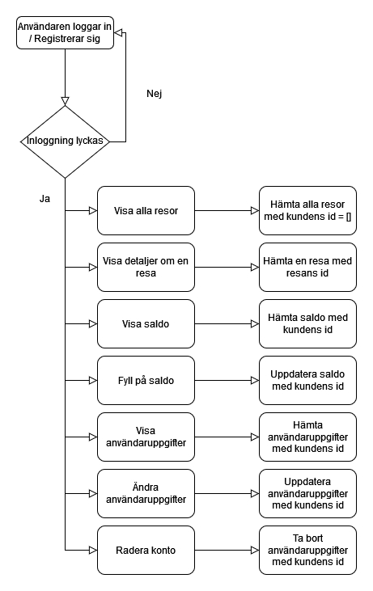
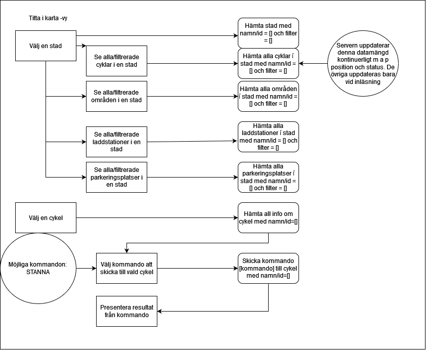
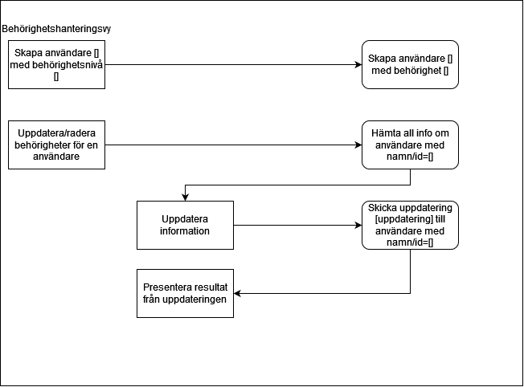

# Elsparkcyklar AB

- [Elsparkcyklar AB](#elsparkcyklar-ab)
  - [Inledning](#inledning)
    - [Bakgrund](#bakgrund)
  - [Översikt över systemet](#översikt-över-systemet)
    - [Systemets användare](#systemets-användare)
    - [Systemets delar](#systemets-delar)
  - [Användarens app](#användarens-app)
  - [Användarens webbgränssnitt](#användarens-webbgränssnitt)
  - [Administratörsgränssnitt](#administratörsgränssnitt)
    - [Översikt och daglig drift](#översikt-och-daglig-drift)
    - [Hantering av kunder](#hantering-av-kunder)
    - [Behörighetshantering](#behörighetshantering)
    - [Geodatahantering](#geodatahantering)
  - [Elsparkcykelns mjukvara](#elsparkcykelns-mjukvara)
  - [Backend](#backend)
    - [Databas](#databas)
      - [Stad](#stad)
      - [Elsparkcykel](#elsparkcykel)
      - [Laddstation](#laddstation)
      - [Parkeringsplats](#parkeringsplats)
      - [Zon](#zon)
      - [Verkstad (ska verkstäder vara med?)](#verkstad-ska-verkstäder-vara-med)
      - [Användare](#användare)
      - [Administratör](#administratör)
      - [Resa](#resa)
    - [REST-API](#rest-api)
      - [Substantiv](#substantiv)
      - [Verb](#verb)
      - [Dokumentation](#dokumentation)
      - [Versioner](#versioner)
      - [Autentisering](#autentisering)
        - [Godkänd autentisering](#godkänd-autentisering)
        - [Misslyckad autentisering](#misslyckad-autentisering)

## Inledning

I detta dokument beskrivs ett system som hanterar uthyrning av elsparkcyklar. Systemet ger kunder möjlighet att skapa användarkonton och hyra cyklar, administratörer ges möjlighet att administrera cyklar, laddstationer, parkeringsplatser, städer och information om kunder. Systemet innehåller också ett program för cykeln som styr och övervakar denna.

### Bakgrund

Företaget "Svenska Elsparkcyklar AB" har utryckt ett behov av ett system som kan hantera uthyrning av elsparkcyklar i svenska städer. För närvarande är företaget etablerat och har verksamhet i "TRE STÄDER" och planerar att expandera till fler med stöd av ett nytt datasystem.

Elsparkcyklar är ett, jämfört med andra fortskaffningsmedel, relativt nytt inslag i vår trafikmiljö. De utgör ett nytt sätt att röra sig och kan med rätt förutsättningar utgöra ett miljövänligt sätt att öka transporteffektiviteten i våra städer. Utmaningarna är dock flera, i en utredning från 2021 påpekar Transportstyrelsen att regelverket kan upplevas som otydligt och att många upplever att de som använder cyklarna inte beter sig korrekt. Transportstyrelsen menar i sin utredning att det framförallt rör sig om att användarna parkerar fel och framför fordonen på ett felaktigt sätt. [1] Sedan 1:a september 2022 får elsparkcyklar inte längre framföras på trottoarer och gångbanor och felparkerade cyklar kan beläggas med avgifter. [2]

Vår förhoppning är att det system som vi presenterar här kommer att kunna lösa en del av dessa utmaningar, inte minst genom att uppmuntra användarna till ett korrekt bruk av cyklarna och genom att automatiskt begränsa var och med vilken hastighet cyklarna kan köras.

## Översikt över systemet

### Systemets användare

Systemets huvudsakliga användare är kunder (benämns härefter som användare) och administratörer.

Användare har möjlighet att hyra en cykel via en mobilapplikation som också visar status för senaste resan och en historik över gjorda resor. Användare har också tillgång till ett webbgränssnitt där de kan se sina kontodetaljer och en historik över sin användning och betalningar.

Administratörer har möjlighet att via ett webbgränssnitt se status på cyklar och stationer samt få information om kunder. Administratörer kan också lägga till nya cyklar, laddstationer, zoner för parkering, förbjudna zoner och städer.

### Systemets delar

Systemet omfattar följande huvudsakliga komponenter:

- Databas med information om cyklar, laddstationer, parkeringszoner, tillåtna zoner att cykla i, användare och administratörer.

- Backend - en komponent som sköter kopplingen mellan API och databas.

- API med möjlighet att koppla in anpassade applikationer, grundsystemet levereras med följande applikationer:

  - Administrativt webbgränssnitt där man kan se status för och administrera (ändra, ta bort och lägga till) cyklar, laddstationer, parkeringsplatser, städer och information om kunder.

  - Webbgränssnitt för kunden så att denne kan logga in och se sitt konto, historik av utlåning och betalningar.

  - Mobilanpassad webbapp för kunden så denne kan se låna/lämna tillbaka cykeln samt se status på senaste resan och historik över gjorda resor.

  - Ett cykelprogram som styr och övervakar cykeln (på, av, hastighet, begränsa hastighet, position, behöver service/laddning).

Samtliga applikationer som kopplas mot API:et måste autentisera sin anslutning.

Nedanstående diagram visar en översikt över systemets huvudkomponenter samt hur de relaterar till- och kommunicerar med varandra i olika lager. [3]

*Fig 1. Översikt över systemets huvudkomponenter*

I följande avsnitt beskriver vi systemets olika delar i detalj.

[1] <https://www.transportstyrelsen.se/globalassets/global/publikationer-och-rapporter/vag/slutrapport-utredning-regler-eldrivna-enpersonsfordon.pdf>

[2] Se Jönköpingsposten 3/9 2022 samt <https://rkrattsbaser.gov.se/sfst?bet=1998:1276> $4

[3] Se <https://www.oreilly.com/content/software-architecture-patterns/>

## Användarens app

*Hemskärm i mobilapp*

Alternativt kartbild istället för Hemskärm

I användarens app kan en användare hyra och återlämna elsparkcyklar. Appen är mobilanpassad och byggs i React. Elsparkcyklar som är registrerade i systemet för uthyrning och inte upptagna eller under service kan av en användare väljas för uthyrning via en app. För att kunna hyra en elsparkcykel måste användaren autentisera och identifiera sig, detta görs via Ouath med ett GitHub konto. När användaren loggar in i appen visas en kartbild med tillgängliga elsparkcyklar, laddstationer och rekommenderade parkeringsplatser. I vårt program identifieras en elsparkcykel genom att från kartbilden välja elsparcykelns ikon vilket ger användaren möjligheten att välja vald elsparkcykel för uthyrning.

Då en uthyrning påbörjats så låses cykeln upp och användaren kan manövrera elsparkcykeln under hyrtiden.

Användaren kan också, via appen, få information från den hyrda elsparkcykeln i form av:

- batterinivå
- behov av service (med anledning av t.ex. punktering, trasiga lampor eller dåliga bromsar)

Då användaren avslutar sin sin resa och återlämnar elsparkcykeln så debiteras användarens konto automatiskt för färden. Färdens kostnad kan variera beroende på:

- hur lång hyrestiden är
- om cykeln flyttats från fri parkering (valfri parkeringsplats utanför rekommenderade parkeringszoner) till en mer önskvärd parkeringsplatsen
- om cykeln parkeras genom fri parkering

När färden avslutats låses cykeln igen.

Denna bild ger en översikt över flödet för att hyra en elsparkcykel i användarens mobilapp runda cirklar visar kommandon som utförs i backend.

Figur - flödet i användarens app vid uthyrning av elsparkcykel.

## Användarens webbgränssnitt

*Hemskärm i webbläsare för dator*

Denna del av systemet är en desktop-app som byggs i React - ett JavaScript bibliotek för att skapa användargränssnitt.[1] I användarens webbgränssnitt kan en användare logga in för att se och ändra detaljer om sitt konto. Användaren skapar ett konto och loggar in via OAuth med hjälp av sina Github uppgifter.

Det är också möjigt att skapa ett konto på sedvanligt vis genom att uppge:

- förnamn
- efternamn
- adress
- faktureringsadress
- användarnamn
- lösenord

När användaren loggar in har denne möjlighet att ändra detaljer angående kontot eller radera det.

Användaren kan i webbgränssnitttet också se detaljer om sina resor som innefattar:

- ID på resan
- Startdatum (2000-01-01)
- Starttid (11:11 LT)
- Slutdatum (2000-01-01)
- Sluttid (11:11 LT)
- Startpunkt
- Slutpunkt
- Kostnad för resan (kronor, ören)

Slutligen kan användaren då denne loggat in på sitt konto också se och fylla på det saldo som används för att bekosta resor med elsparkcykel. Alternativt kan användaren koppla sig till och betala via en betalningstjänst, i så fall dras en avgift varje månad.

Nedanstående diagram visar flödet i användarens webbgränssnitt:

[1] Se <https://reactjs.org/>

## Administratörsgränssnitt

Systemets administratörsgränssnitt används av behöriga användare för att få en översikt över företagets alla resurser:

- Kunder
- Städer man är verksam i
- Cyklar
- Laddstationer
- Parkeringsplatser
- Områden med särskilda bestämmelser

Administratörsgränssnitt innehåller vyer för att inspektera resurser, skicka kommandon till enskilda cyklar, hantera kundinformation, hantera behörigheter, samt uppdatera systemet med ny data, t ex nya städer man etablerar sig i, nya cyklar, nya parkeringsplatser etc.

### Översikt och daglig drift

I vyn för översikt och daglig drift presenteras all information kring cyklar, laddstationer, parkeringsplatser och områden med särskilda bestämmelser för varje stad man verkar i. Vyn är kartcentrerad. I kartan kan man se information om aktuell status för alla tillgängliga resurser i vald stad, samt även filtrera kartvyn baserat på resursers typ, identitet eller status. Denna vy används också för att skicka manuella driftkommandon till enskilda cyklar. Det kan t ex  vara ett kommando för att stoppa cykeln, om administratören ser behov av det.

*Översiktsvy från systemet*

### Hantering av kunder

Kundvyn är en klassisk listvy. Här kan man se en lista på alla företagets kunder, som kan filtreras på stad, användarnamn, antal gjorda resor m m. I denna vyn kan administratören också uppdatera information om enskilda kunder, t ex för att ge en kund en generell rabatt eller rabatt för en enskild resa. Administratören kan också skapa upp nya kunder i denna vy, även om detta i normalfallet hanteras av kunden själv.

*Kundvy från systemet*

### Behörighetshantering

Vyn för behörighetshantering används för att skapa användare och tilldela dessa behörigheter i administratörssystemet. Huvudadministratören anges vid konfiguration av systemet, men alla övriga roller hanteras i detta gränssnitt.

*Behörighetsvy från systemet*

### Geodatahantering

Systemet har kraftfulla och lättanvända funktioner för att hantera nya marknader och nya resurser. I vyn för geodatahantering kan administratören lägga till nya städer för företaget, samt skapa, uppdatera och radera information om enskilda resurser.

*Kartredigeringsvy från systemet*

## Elsparkcykelns mjukvara

En elsparkcykels huvudsakliga uppgift är att hela tiden meddela sin positon och hälsa via API&rsquo;et.

Elsparkcykelns har sensorer som samlar in information som rör dess egen position samt funktionsstatus:

- Batterinivån är låg
- En lampa har gått sönder
- Punktering

Dessa statusindikatorer skickas till backend. Backend matar i sin tur elsparkcykeln med information som rör dess omgivning:

- Uthyrd till en användare
- Användare avslutar hyran
- Begränsa hastighet när den befinner sig i specifika zoner
- Stoppa elsparkcykeln ifall den är utanför tillåtet område.
- Intagen på service
- Service utförd

Det är endast när elsparkcykelns status har blivit ändrad till &rdquo;uthyrd&rdquo; eller på &rdquo;service som
elsparkcykeln är upplåst och går att köra. Så fort dess status återvänder till &rdquo;ledig&rdquo; så
stängs den av och bromsas, och det enda sättat att flytta den är då att fysiskt lyfta upp och bära bort den.
Blir det rörelse på en elsparkcykel som ej är uthyrd skickas då en varning omgående till backend,
och sedan med ett tätt intervall tills den återigen står stilla. Detta möjliggör att personal kan hitta eventuellt stulna
elsparkcykelar.

Tusentals elsparkcyklar finns i systemet. För att minimera belastningen på API och backend så
uppdaterar dom sin position med olika intervall beroende på olika faktorer.

- En uthyrd elsparkcykel i rörelse skickar positionsdata ofta
- En ledig och stillastående elsparkcykel skickar positionsdata sällan
- En elsparkcykel på laddning eller service skickar positionsdata sällan

Vae elsparkcykel sparar också en egen historik över alla sina resor.

- Resans användare
- Resans startposition samt klockslag
- Resans slutposition samt klockslag

## Backend

De grundläggande kraven för systemets backend är:

- Databasen skall kunna hantera relevant data.
- Systemet skall erbjuda ett väldokumenterat REST API som tredjepartsleverantörer kan använda för att bygga extra tjänster och applikationer.
- REST API:et skall kunna hantera flera olika versioner, t ex genom att använda v1/ som en del i URI:n.
- REST API:et skall hantera autentisering så man kan kontrollera/begränsa belastningen som varje applikation ger.

Med underlag av data från tester med MongoDb och MariaDb, där respektive databas belastades med en stor mängd anrop under kort tid,
valdes MariaDb som databas för att hantera all data.
Samma tester visade också på stora skillnader i prestanda mellen en FastApi (Python) och Express (node) server, där Express
visade sig vara det bättre valet.
Städernas geodata fås från "TODO". Det är ett fritt bibliotek som erbjuder den data som behövs.

Kommunikation mellan klienter och backend sker via API't och där klinten enbart känner till sin egen data och
backend har data över alla delar i systemet.
Några exempel på kommunikationen är:

*Några övergripande exempel på kommunikationen*

### Databas

Information systemets olika entiteter samlas i en databas. En entitet kan t.ex. vara "användare", "stad" eller "administratör". Varje entitet har en egen tabell i databasen. I detta avsnitt beskrivs vilka entiteter som finns i databasen, vilka egenskaper de har och hur entiteterna relaterar till varandra.

Den databas som ingår i systemet är en DATABASTYP. Systemet kommunicerar med databasen via ORM/SQL/Redis? (Byggs ut när vi har bestämt oss)

Följande tabeller/entiteter finns i databasen:

#### Stad

Denna tabell innehåller information om städer. Varje stad har:

- ett unikt id som identifierar staden i systemet
- ett namn
- en geografisk position

En stad har också relationer till andra entiteter den kan ha en eller flera:

- Elsparkcyklar
- Laddstationer
- Parkeringsplatser
- Zoner
- Verkstäder?

#### Elsparkcykel

Denna tabell innehåller information om elsparkcyklar. Varje elsparkcykel har

- ett unikt id
- en position
- en status, ett värde som visar om elsparkcykeln är ok, laddas eller behöver service
- en batterinivå
- en uthyrningsstatus som visar om elsparkcykeln är uthyrd eller inte
- en hastighet

En elsparkcykel har också relationer till andra entiteter, den kan ha:

- en användare (om elsparkcykeln är uthyrd)
- en eller flera (historiska) resor

#### Laddstation

Denna tabell innehåller information om laddstationer. Varje laddstation har:

- ett unikt id
- en position

Bör vi också koppla elsparkcyklar till specifika laddstationer?

#### Parkeringsplats

Denna tabell innehåller information om parkeringsplatser, både tillåtna och otillåtna. Varje parkeringsplats har:

- ett unikt id
- en position
- en typ som talar om ifall detta är en "+parkeringsplats" en vanlig parkeringsplats eller en förbjuden parkeringsplats

#### Zon

Denna tabell innehåller information om särskilda zoner. Varje zon har:

- ett unikt id
- en position
- en typ som visar om det är tillåtet att färdas i zonen eller inte
- en hastighetsbegränsning som bestämmer högsta tillåtna hastighet i zonen?

#### Verkstad (ska verkstäder vara med?)

Denna tabell innehåller information om verkstäder där elsparkcyklar servas och repareras. Varje verkstad har:

- ett unikt id
- en position

#### Användare

Denna tabell innehåller information om användare. Varje användare har:

- ett unikt id
- ett förnamn (får vi detta med OAuth?)
- ett efternamn (får vi detta med OAuth?)
- en adress (får vi detta med OAuth?)
- en faktureringsadress (får vi detta med OAuth?)
- ett användarnamn (behöver vi detta med OAuth?)
- ett lösenord (behöver vi detta med OAuth?)
- en e-postadress
- ett saldo
- en position? (behöver vi användarnas positioner?)
- en status som visar om användaren är inloggad eller inte? (behöver vi detta?)

En användare har också relationer till andra entiteter, den kan ha:

- en elsparkcykel (om användaren hyr en cykel)
- en eller flera (historiska) resor

#### Administratör

Denna tabell innehåller information om administratörer. Varje administratör har:

- ett unikt id
- ett användarnamn
- ett lösenord
- en typ som beskriver administratörens behörighet (huvudadministratör eller vanlig administratör)

#### Resa

Denna tabell innehåller information om resor. Varje resa har:

- ett unikt id
- en startposition
- en slutposition
- en starttid
- en sluttid

Nedanstående bild visar de entiteter som förekommer i databasen, deras attribut och inbördes relationer.

### REST-API

#### Substantiv

- Användare
- Administratör
- Huvudadministratör
- Elsparkcykel
- Laddstation
- Stad
- Förbjuden zon
- Verkstad

#### Verb

- En användare ska hyra en elsparkcykel

`URL`                         | `GET`                                  | `POST`                         | `PUT`                                       | `DELETE`
------------------------------|:--------------------------------------:|:------------------------------:|:-------------------------------------------:|:-------------------:
`/users/`                     | Visa alla användare                    | Skapa en ny användare          | :x:                                         | :x:
`/users/{id}`                 | Visa en användare med id {id}          | :x:                            | Modifiera en användare med id {id}          | Ta bort en användare med id {id}
`/users/{id}/position`        | Visa positionen för en användare med id {id} | :x:                      | :x: | :x:
`/users/{city}/`              | Visa alla användare som för tillfället hyr en elsparkcykel i stad {city} | :x: | :x: | :x:
`/users/online/`              | Visa alla användare som för tillfället är online | :x: | :x: | :x:
`/users/offline/`             | Visa alla användare som för tillfället är offline | :x: | :x: | :x:
`/administrators/`            | Visa alla administratörer              | Skapa en ny administratör      | :x:                                         | :x:
`/administrators/{id}`        | Visa en administratörer med id {id}    | :x:                            | Modifiera en administratör med id {id}      | Ta bort en administratör med id {id}
`/mainAdministrators/`        | Visa alla huvudadministratör           | Skapa en ny huvudadministratör | :x:                                         | :x:
`/mainAdministrators/{id}`    | Visa en huvudadministratör med id {id} | :x:                            | Modifiera en huvudadministratör med id {id} | Ta bort en huvudadministratör med id {id}
`/cities/`                    | Visa alla städer                       | Skapa en ny stad               | :x:                                         | :x:
`/cities/{id}`                | Visa en stad med id {id}               | :x:                            | Modifiera en stad med id {id}               | Ta bort en stad med id {id}
`/cities/{id}/forbiddenZones/` | Visa alla förbjudna zoner i stad med id {id} | :x: | :x: | :x:
`/cities/{id}/electricScooters/` | Visa alla elsparkcyklar i stad med id {id} | :x: | :x: | :x:
`/cities/{id}/chargingStations/`  | Visa alla laddstationer i stad med id {id} | :x: | :x: | :x:
`/cities/{id}/workshops/`     | Visa alla verkstäder i stad med id {id}  | :x:           | :x:                                         | :x:
`/electricScooters/`          | Visa alla elsparkcyklar                | Skapa en ny elsparkcykel       | :x:                                         | :x:
`/electricScooters/rented`    | Visa alla elsparkcyklar som just nu är uthyrda | :x: | :x:                                         | :x:
`/electricScooters/stale`     | Visa alla elsparkcyklar som just nu inte är uthyrda | :x: | :x:                                         | :x:
`/electricScooters/serviced`  | Visa alla elsparkcyklar som just nu är under service | :x: | :x:                                         | :x:
`/electricScooters/{id}`      | Visa en elsparkcykel med id {id}       | :x:                            | Modifiera en elsparkcykel med id {id}       | Ta bort en elsparkcykel med id {id}
`/electricScooters/{id}/position` | Visa positionen för en elsparkcykel med id {id} | :x: | :x: | :x:
`/electricScooters/{id}/batteryLevel` | Visa batterinivån för en elsparkcykel med id {id} | :x: | :x: | :x:
`/electricScooters/{id}/stop` | :x:                                    | Stoppa elsparkcykeln           | :x:                                         | :x:
`/chargingStations/`          | Visa alla laddstationer                | Skapa en ny laddstation        | :x:                                         | :x:
`/chargingStations/{id}`      | Visa en laddstation med id {id}        | :x:                            | Modifiera en elsparkcykel med id {id}       | Ta bort en elsparkcykel med id {id}
`/forbiddenZones/`            | Visa alla förbjudna zoner              | Skapa en ny förbjuden zon      | :x:                                         | :x:
`/forbiddenZones/{id}`        | Visa en förbjuden zon med id {id}      | :x:                            | Modifiera en förbjuden zon med id {id}      | Ta bort en förbjuden zon med id {id}
`/workshops/`                 | Visa alla verkstäder                   | Skapa en ny verkstad           | :x:                                         | :x:
`/workshops/{id}`             | Visa en verkstad med id {id}           | :x:                            | Modifiera en verkstad med id {id}           | Ta bort en verkstad med id {id}
`/parkingZones/`              | Visa en alla parkeringplatser          | Skapa en ny parkeringsplats    | :x:           | :x:
`/parkingZones/{id}`          | Visa en parkeringplats med id {id}     | :x:    | Modifiera en parkeringsplats med id {id}           | Ta bort en parkeringsplats med id {id}
`/trips/`                     | Visa alla resor     | Skapa en ny resa    | :x:            | :x:
`/trips/{id}`                 | Visa en resa med id {id}     | :x:    | Modifiera en resa med id {id}           | Ta bort en resa med id {id}
`/trips/{userId}`             | Visa alla resor med användar-id {användar-id}     | :x:    | :x:           | :x:

Systemets applikationer använder ett REST-API för att kommunicera med systemets backend.

(Känns som jag behöver skriva lite mer i denna del men kommer inte på vad.)

#### Dokumentation

För att underlätta för tredjepartsleverntörer att bygga externa tjänster och applicationer är
REST-API&rsquo;et väldokumenterat.

- Länk till dokumentationen?
- Ett exempel från dokumentationen på en enskild endpoint?

#### Versioner

REST-API&rsquo;et har byggts för att vara framtidssäkert där uppdateringar och tillägg hanteras med
versionsnummer som en del i URI:n.

#### Autentisering

Alla applikationer som använder REST-API&rsquo;et måste autentisera (JWT?) sig för att kontrollera att endast
endpoints som rör applikationen finns tillgängliga.

##### Godkänd autentisering

En applikation för administratörer kan se alla användare i systemet.

    GET ../v1/users/

    {
        "data": [
            {
                "id": 1,
                "name": "John Doe",
                ...
            },
            {
                "id": 2,
                "name": "Jane Doe",
                ...
            }
        ]
    }

##### Misslyckad autentisering

En applikation för användare kan **inte** se alla användare i systemet.

    GET ../v1/users/

    {
        "errors": {
            "status": 401,
            "source": "/users",
            "title": "Authorization failed",
            "detail": "No valid API key provided."
        }
    }
